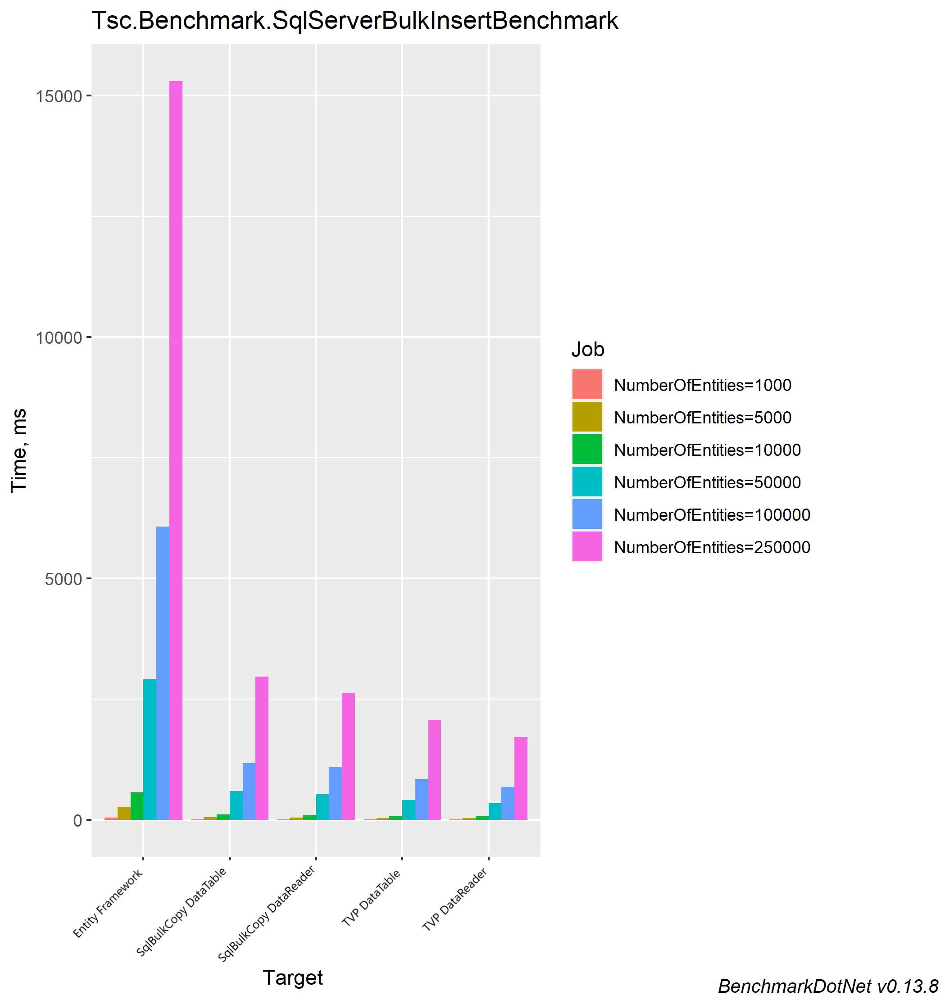

#### Background

I decided to investigate some of the various ways I could bulk insert records into a SQL Server Database efficiently and document the benchmarks of each methodology. This is purely based on an insert operation only, we wont't get the generated Ids of the records. The structure of the record is not very wide and its simple in nature. To generate the test data I used a framework called Bogus which requires very minimal setup to generate a lot of data.

The possible ways that I could think of were

1. Using Entity Framework
2. Using SqlBulkCopy
3. Using SQL combined with a TVP (Table Valued Parameter)

My money was on SqlBulkCopy approach as this is very fast and efficient than EF as there are a number of round trips EF has to make to update the entities. I used BenchmarkDotNet to perform the benchmarking. As a tweak for the SqlBulkCopy and SQL TVP benchmarks I created a `DomainDataReader<T>` which inherits from `DbDataReader`, the `DomainDataReader` can then be used as SQL parameter for the SQL TVP and `SqlBulkCopy.WriteToServer` which accepts a `IDataReader` and `DbDataReader` implements this. My thinking was to determine if there was much improvement to the cost of converting a List into a DataTable which can also be used as inputs.

#### Results

```

BenchmarkDotNet v0.13.8, Windows 10 (10.0.19045.3448/22H2/2022Update)
Intel Xeon CPU E5-2667 v3 3.20GHz, 1 CPU, 16 logical and 8 physical cores
.NET SDK 7.0.401
  [Host] : .NET 7.0.11 (7.0.1123.42427), X64 RyuJIT AVX2

Toolchain=InProcessEmitToolchain  InvocationCount=1  UnrollFactor=1  

```



<style scoped>
table {
  font-size: 12px;
}
</style>
| Method                                    | NumberOfEntities | Mean         | Error      | StdDev     |
|------------------------------------------ |----------------- |-------------:|-----------:|-----------:|
| **EntityFrameworkBulkInsert**                 | **1000**             |     **51.81 ms** |   **1.005 ms** |   **1.505 ms** |
| SqlBulkCopyWithDataTable                  | 1000             |     15.19 ms |   0.107 ms |   0.095 ms |
| SqlBulkCopyWithDomainDataReader           | 1000             |     14.80 ms |   0.262 ms |   0.245 ms |
| TableValuedPararmeterWithDataTable        | 1000             |     10.99 ms |   0.128 ms |   0.120 ms |
| TableValuedPararmeterWithDomainDataReader | 1000             |     12.27 ms |   0.214 ms |   0.200 ms |
| **EntityFrameworkBulkInsert**                 | **5000**             |    **273.85 ms** |   **1.652 ms** |   **1.380 ms** |
| SqlBulkCopyWithDataTable                  | 5000             |     58.43 ms |   0.335 ms |   0.313 ms |
| SqlBulkCopyWithDomainDataReader           | 5000             |     54.38 ms |   0.613 ms |   0.573 ms |
| TableValuedPararmeterWithDataTable        | 5000             |     42.87 ms |   0.373 ms |   0.349 ms |
| TableValuedPararmeterWithDomainDataReader | 5000             |     39.37 ms |   0.501 ms |   0.444 ms |
| **EntityFrameworkBulkInsert**                 | **10000**            |    **572.65 ms** |   **7.059 ms** |   **6.258 ms** |
| SqlBulkCopyWithDataTable                  | 10000            |    115.55 ms |   0.963 ms |   0.804 ms |
| SqlBulkCopyWithDomainDataReader           | 10000            |    107.18 ms |   1.137 ms |   1.008 ms |
| TableValuedPararmeterWithDataTable        | 10000            |     81.77 ms |   0.915 ms |   0.855 ms |
| TableValuedPararmeterWithDomainDataReader | 10000            |     73.50 ms |   0.890 ms |   0.833 ms |
| **EntityFrameworkBulkInsert**                 | **50000**            |  **2,911.51 ms** |  **10.471 ms** |   **9.282 ms** |
| SqlBulkCopyWithDataTable                  | 50000            |    598.60 ms |   5.232 ms |   4.894 ms |
| SqlBulkCopyWithDomainDataReader           | 50000            |    534.57 ms |   4.188 ms |   3.497 ms |
| TableValuedPararmeterWithDataTable        | 50000            |    417.25 ms |   1.996 ms |   1.867 ms |
| TableValuedPararmeterWithDomainDataReader | 50000            |    344.06 ms |   1.693 ms |   1.583 ms |
| **EntityFrameworkBulkInsert**                 | **100000**           |  **6,071.69 ms** |  **60.348 ms** |  **56.449 ms** |
| SqlBulkCopyWithDataTable                  | 100000           |  1,178.88 ms |   7.991 ms |   7.475 ms |
| SqlBulkCopyWithDomainDataReader           | 100000           |  1,091.01 ms |  15.879 ms |  13.260 ms |
| TableValuedPararmeterWithDataTable        | 100000           |    838.14 ms |   9.940 ms |   8.812 ms |
| TableValuedPararmeterWithDomainDataReader | 100000           |    686.74 ms |  10.400 ms |   9.220 ms |
| **EntityFrameworkBulkInsert**                 | **250000**           | **15,295.58 ms** | **293.972 ms** | **288.720 ms** |
| SqlBulkCopyWithDataTable                  | 250000           |  2,964.85 ms |  26.994 ms |  23.929 ms |
| SqlBulkCopyWithDomainDataReader           | 250000           |  2,624.36 ms |   8.530 ms |   7.123 ms |
| TableValuedPararmeterWithDataTable        | 250000           |  2,072.21 ms |   8.270 ms |   6.906 ms |
| TableValuedPararmeterWithDomainDataReader | 250000           |  1,715.64 ms |  14.480 ms |  13.545 ms |


As you can see the EF method becomes VERY inefficient once you start going past 10,000, albeit further testing will be required to see its a linear increase or an exponential one. Also notice that there is slight performance improvement using DomainDataReader. I am assuming this was due to the fact that we are not generating a DataTable before the insert operations. I was pleasantly suprised that the TVP method was on par if not slight faster than the SQLBulkCopy method as well.

#### Summary

For bulk operations its best not to use EF to do this, anything above a couple of 1000 records is not ideal. I would utilize either SqlBulkCopy or the SQL TVP approaches. If you want to keep things simple and just perform insert operations then the SqlBulkCopy is adequate enough. 

However with using SQL TVP approach, you have the ability to perform other operations such as upserts once you get data into SQL Server.

There are paid solutions such as Dapper Plus which are pretty performant on bulk insertions as well, but I thought I'd stick to free stuff and see how I get on with that first!
